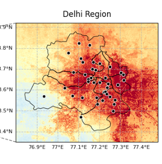
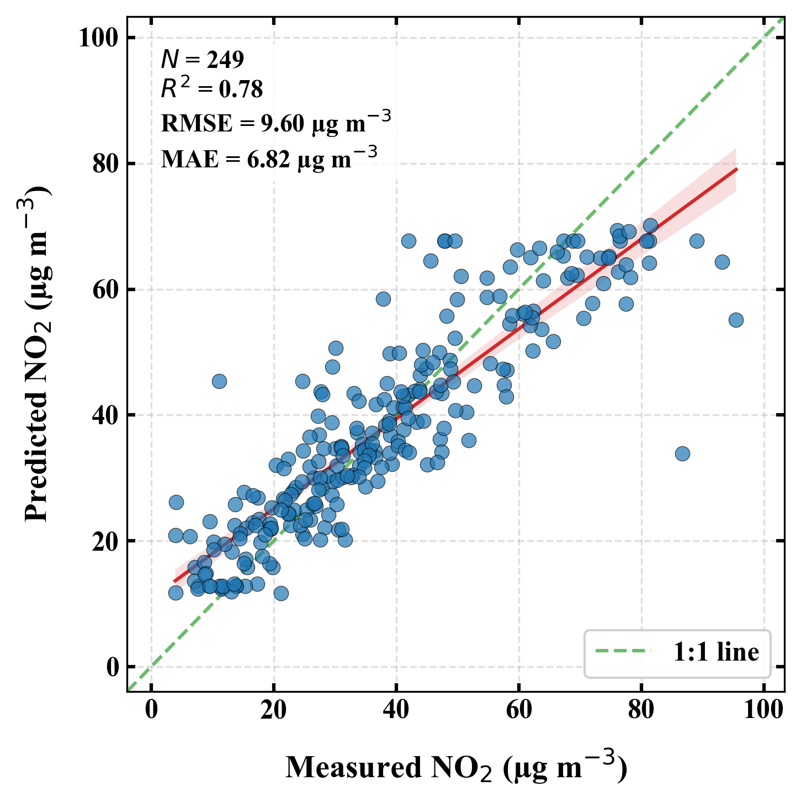

# Delhi NO2 ML Pipeline

**Predicting high-resolution surface NO2 concentrations over Delhi using a stacked
ensemble of ML/DL models, trained on ground station, satellite, and reanalysis data.**

> Data-fusion pipeline combining CPCB ground monitoring, ERA5 reanalysis, TROPOMI
> satellite NO2, night-light, land-use, elevation, population, road-density and NDVI
> covariates into a Random Forest / XGBoost / LightGBM / LSTM stacked-ensemble model,
> to estimate NO2 at 90m resolution across Delhi (2019–2024).

## Overview

Ground-based air quality monitors are sparse and expensive to deploy, but satellite
and reanalysis products offer dense spatial coverage at coarser accuracy. This
project fuses both: it trains a meta-learner stacking ensemble on CPCB station
measurements as ground truth, using satellite/reanalysis/geospatial layers as
predictors, to produce continuous, high-resolution NO2 estimates over the Delhi NCR.

**Highlights:**
- 15+ geospatial/meteorological covariates fused via `xarray` across 6 years of data
- Stacked ensemble: Random Forest, XGBoost, LightGBM, LSTM → LightGBM meta-learner
- Seasonal and spatial visualization with `cartopy`/`matplotlib`
- Fully reproducible: no hardcoded personal paths, data-agnostic via env vars

## Results

**Final stacked model:** R² = **0.779**, MAE = **6.82 µg/m³**

| Base model | Best R² |
|---|---|
| Random Forest | 0.508 |
| XGBoost | 0.508 |
| LightGBM | 0.545 |
| Stacked meta-learner (LightGBM) | **0.779** |

Stacking the four base learners lifts R² from ~0.51 (best single model) to 0.78 —
the meta-learner captures complementary error patterns across tree-based and
sequence models.


*Annual NO2 climatology (2019–2024) over Delhi, downscaled to 90m with CPCB ground
stations overlaid.*


*Model validation output at 90m resolution across Delhi.*

Best hyperparameters per base model are in [`best_hyperparams.csv`](best_hyperparams.csv).

## Tech stack

`Python` · `pandas` · `xarray` · `scikit-learn` · `XGBoost` · `LightGBM` · `TensorFlow/Keras`
· `cartopy` · `geopandas` · `PyKrige` · `Plotly/Dash`

## Repo structure

```
.
├── notebooks/
│   └── Delhi_ML.ipynb      # main pipeline (data prep -> feature engineering -> modeling -> plots)
├── data/                    # NOT included — see "Data" below (gitignored)
├── models/                  # NOT included — trained model artifacts (gitignored)
├── figures/                 # generated output figures (gitignored)
├── requirements.txt
└── .gitignore
```

## Data (private / not included)

This repo intentionally does **not** include any raw or processed data,
because the underlying station/satellite datasets are private. The
following are excluded via `.gitignore` and must be supplied locally:

- `data/TTAV_Paper/cpcb_sations_lat_lon.csv`
- `data/TTAV_Paper/cpcb_hourly_data_2017_2024_update.csv`
- `data/ERA/...` (Forecast_albedo, Relative_humidity, Temperature, Fraction_of_cloud_cover,
  Total_cloud_cover, Total_precipitation, Surface_pressure, U/V wind components — NetCDF)
- `data/TROPOMI_NO2_varun/...` (TROPOMI NO2, NetCDF)
- `data/Night_light/...`, `data/emission/...`, `data/NDVI/...`, `data/LULC/...`
- `data/elevation/elevation_90.nc`, `data/population/delhi_population.nc`
- `data/Road/delhi_road.nc`, `data/shape_file/Districts.shp` (+ .shx/.dbf/.prj), `data/Zone/zone.shp`
- `models/` — saved model artifacts (`.keras`, `.pkl`, `.csv` metrics)

The notebook reads all paths through environment variables (see below), so
the **code runs for anyone** once they point it at their own copy of this
data — no personal file paths are hardcoded. Raw data is held in a separate
private repo and isn't publicly distributed here.

## Setup

```bash
python -m venv .venv
source .venv/bin/activate        # Windows: .venv\Scripts\activate
pip install -r requirements.txt
```

Point the notebook at your local data before running:

```bash
export DELHI_DATA_DIR=/path/to/your/data      # Windows: set DELHI_DATA_DIR=D:\your\data
export DELHI_MODEL_DIR=/path/to/your/models
export DELHI_FIGURES_DIR=/path/to/your/figures
jupyter notebook notebooks/Delhi_ML.ipynb
```

If the environment variables aren't set, the notebook defaults to
`./data`, `./models`, `./figures` relative to the repo.

## Notes

- All cell outputs were cleared before committing (dataframe previews /
  printed arrays could otherwise leak private data into the public repo —
  re-run the notebook locally to regenerate them).
- A couple of paths (e.g. the LSTM model save path) landed under `DATA_DIR`
  after the automatic path cleanup — worth double-checking `MODEL_DIR` is
  used consistently for model artifacts before you push.

## License

MIT — see [LICENSE](LICENSE).

## Author

**Varun Katoch** — [LinkedIn:https://www.linkedin.com/in/varun-k-108a68170] ·varunkatoch.katoch@gmail.com

